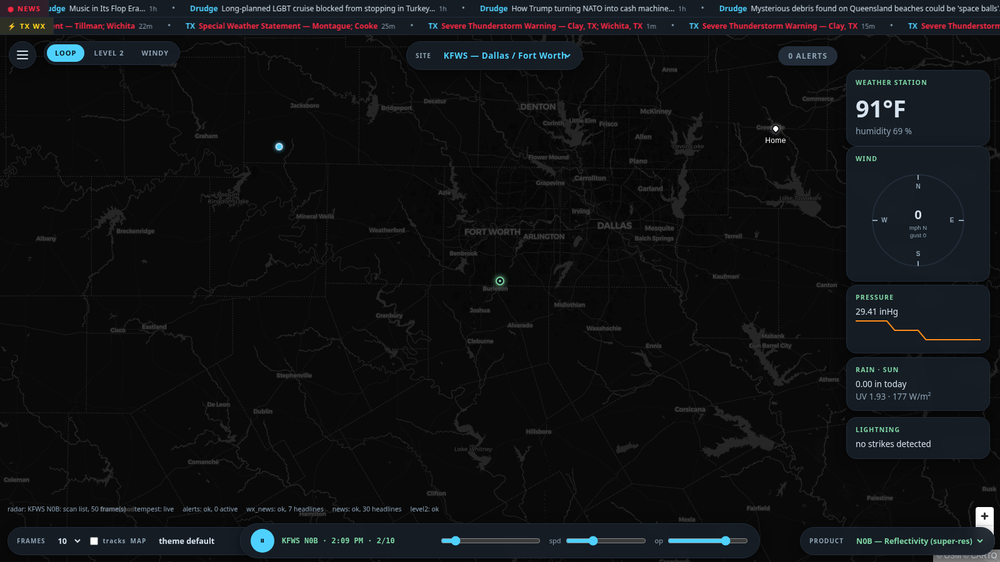
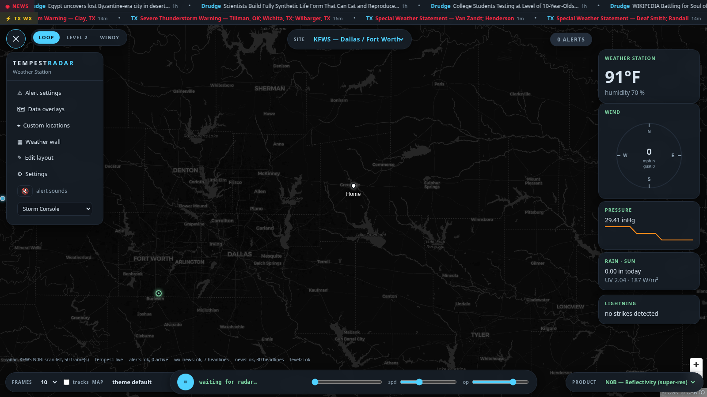
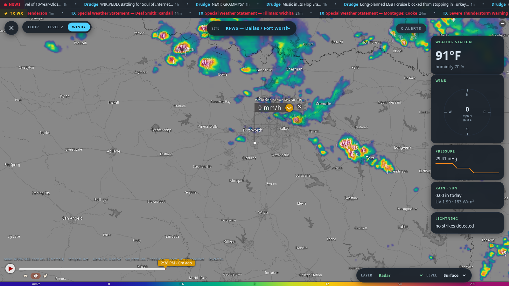
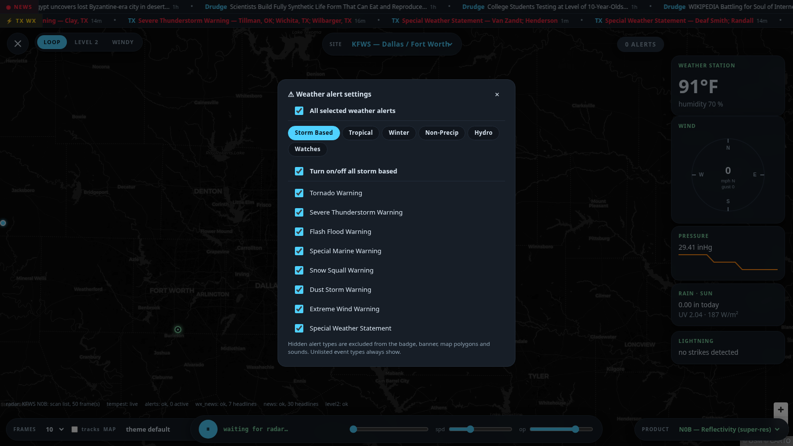
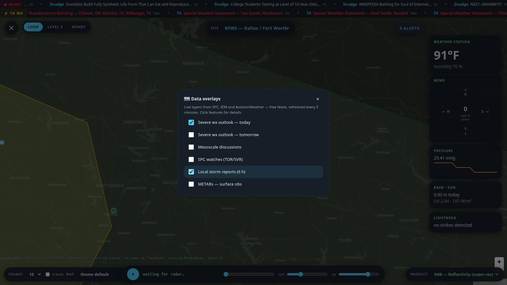
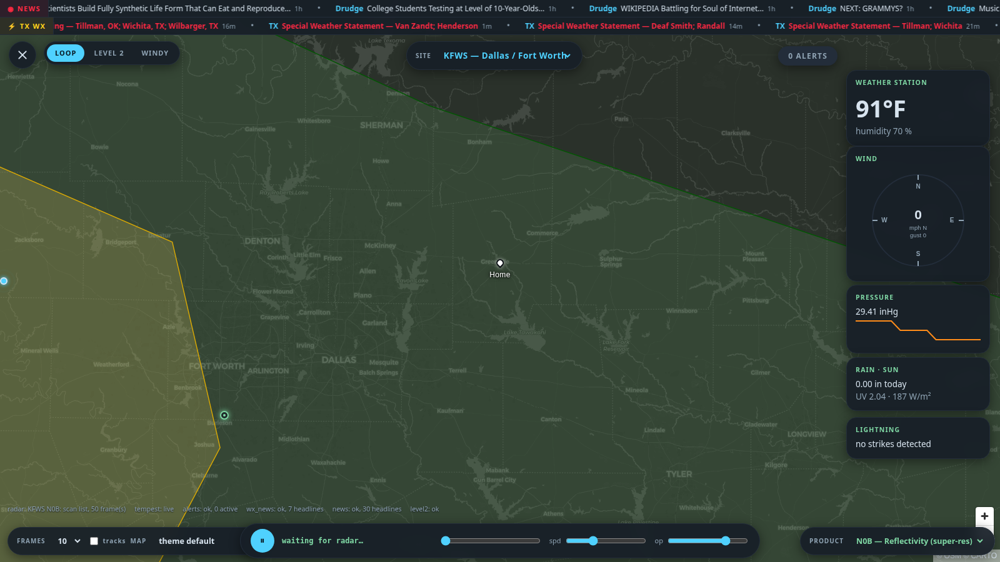
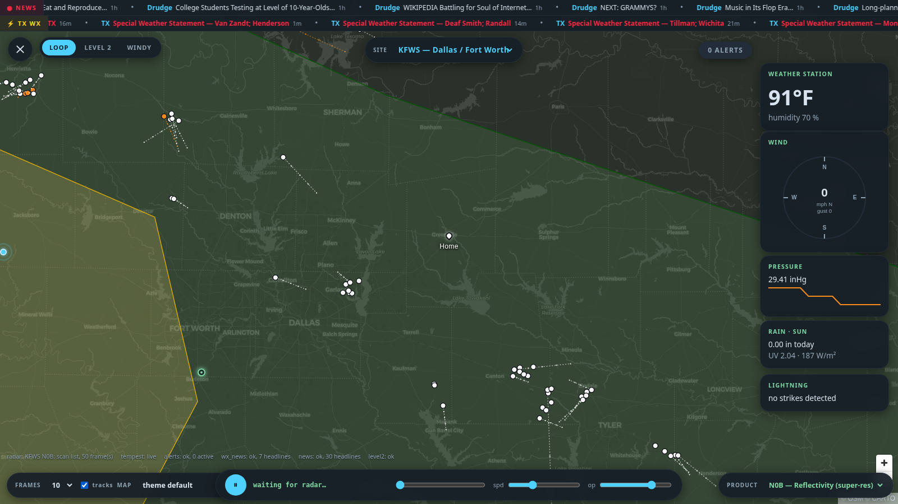
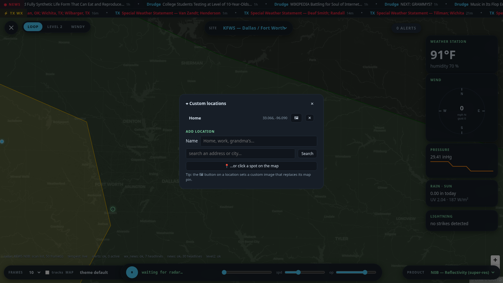
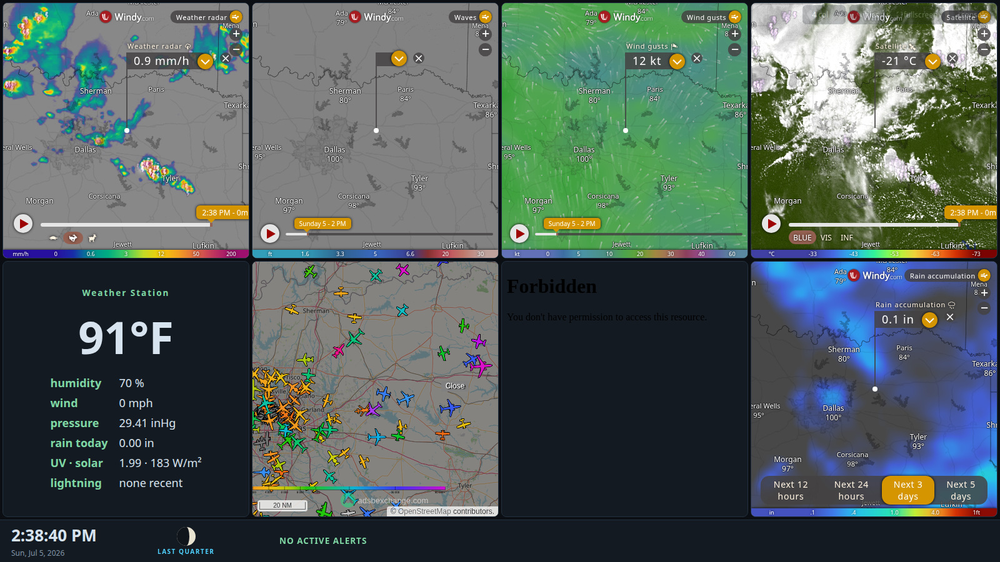

# Tempest Radar — User Guide

Everything in the console floats over a full-screen MapLibre GL map. This
guide walks through each feature. All screenshots are from a live instance.

---

## The main console

| Element | Where | What it does |
|---|---|---|
| ☰ menu button | top-left | Opens the main menu (settings, overlays, wall…) |
| LOOP / LEVEL 2 / WINDY | top-left | Switches the radar view mode |
| SITE pill | top-center | Pick any NEXRAD site (or type a 4-letter ID) |
| Alerts pill | top-right | Active alert count; red + pulsing on extreme alerts |
| Telemetry cards | right rail | Live Tempest station data (see below) |
| Playback bar | bottom-center | Play/pause, frame scrubber, animation speed, radar opacity |
| FRAMES pill | bottom-left | Loop length, storm-track toggle, basemap picker |
| PRODUCT pill | bottom-right | Radar product (reflectivity, velocity, …) |
| News / weather tickers | top edge | Breaking news + severe weather headlines |

Every panel can be moved, resized, or hidden: open **☰ → ✎ Edit layout**,
drag panels where you want them, then press *done*. Layouts can be
exported/imported as JSON.

---

## The menu

- **⚠ Alert settings** — choose which alert types you see
- **🗺 Data overlays** — SPC outlooks, mesoscale discussions, storm reports…
- **⌖ Custom locations** — named pins with optional photos
- **▦ Weather wall** — full-screen TV dashboard at `/wall`
- **✎ Edit layout** — drag/resize/hide any panel
- **⚙ Settings** — Tempest station, location, ticker feeds
- Alert sound toggle and theme picker (5 built-in themes; custom themes
  can be added via `data/themes.json`)

---

## Radar modes

### LOOP — tile animation
Animated NEXRAD imagery for any site, up to 50 frames, with product
switching in the bottom-right pill. Frames are smoothed on the GPU so the
radar looks broadcast-crisp instead of pixelated. The **op** slider dims the
radar without dimming roads/labels (which render *above* the weather).

### LEVEL 2 — raw super-res
Decodes raw NEXRAD Archive II volumes server-side and renders them with a
WebGL custom layer: every tilt, every moment (REF/VEL/SW/ZDR/RHO/PHI),
palette switching, and a **smooth** toggle. This is the highest-fidelity
view — use it during active severe weather.

### WINDY — model overlays
Embeds Windy with a **LAYER** picker (radar, satellite, wind, thunderstorms,
air quality, waves, fires, EFI extreme-forecast indices — 40+ layers) and a
**LEVEL** picker (surface up to 150 hPa).

---

## Weather alert settings

**☰ → ⚠ Alert settings**

A master switch, category tabs (**Storm Based, Tropical, Winter, Non-Precip,
Hydro, Watches**), a per-category master, and an individual toggle for every
NWS event type. Whatever you switch off disappears everywhere at once —
badge count, banner, map polygons, detail list, and sounds. Unlisted event
types always show, so nothing exotic slips past silently. Choices persist
per browser.

---

## Data overlays

**☰ → 🗺 Data overlays**

Free live feeds (no API keys), refreshed every 5 minutes, proxied and cached
by the backend:

| Overlay | Source | Click a feature for… |
|---|---|---|
| Severe wx outlook — today / tomorrow | SPC | risk category, valid window |
| Mesoscale discussions | SPC via IEM | concerning line + link to full MD text |
| SPC watches | IEM | watch number, issue/expire (TOR red, SVR yellow) |
| Local storm reports (6 h) | IEM | event, magnitude, county, spotter remarks |
| METARs — surface obs | AviationWeather | temp, dew point, wind, visibility, raw ob (dots colored by flight category) |

---

## Storm tracks

Enable the **tracks** checkbox in the FRAMES pill.

Each radar-identified cell draws with a dashed projected track and dots at
+15/30/45/60 minutes. Cells are white; a detected **mesocyclone turns the
cell orange** and a **TVS (tornado vortex signature) turns it red**. Click
any cell for its attributes: motion, max dBZ, VIL, and hail probabilities —
with a warning banner when a meso/TVS is flagged.

---

## Custom locations

**☰ → ⌖ Custom locations**

- Add unlimited named pins by **address search** or by **clicking the map**
- Click a row (or a pin) to fly there; ✕ removes it
- The **🖼 button uploads a custom image** — the pin becomes a circular
  photo marker (images are resized in-browser and stored server-side, so
  they appear on every device)
- Locations live in `data/config.json`, surviving restarts

---

## Weather wall (TV mode)

**☰ → ▦ Weather wall**, or open `http://<host>:5555/wall`

A full-screen grid for a wall-mounted TV: Windy layers, aircraft (ADS-B
Exchange / airplanes.live / adsb.fi), ships (VesselFinder / MarineTraffic),
lightning, your station card, a clock, or **any custom URL**. Click ✎ to
change what each tile shows, set the column count, and use ⛶ for
fullscreen. The bottom bar has a clock, moon phase, active-alert readout,
and an optional NOAA tide chart.

---

## Station telemetry & history

The right-rail cards show live Tempest data (wind updates ~every 3 s over
WebSocket). Click any card title for 24 h / 3 d / 7 d history charts.
The lightning card lights up with strike distance in real time.

## Themes & basemaps

Five built-in themes (Storm Console, Midnight OLED, Daylight, Phosphor
Terminal, Chaser Amber). 17 basemaps, including **dark · streets + towns** —
a near-black canvas with bright streets, highway shields, and town labels
that stay readable *above* the radar.

## Tips

- Spacebar toggles radar playback.
- The site can also be changed by clicking any radar-site dot on the map.
- Everything configured in ⚙ Settings is stored in `data/config.json` —
  back up the `data/` folder to keep your config, locations, and photos.
